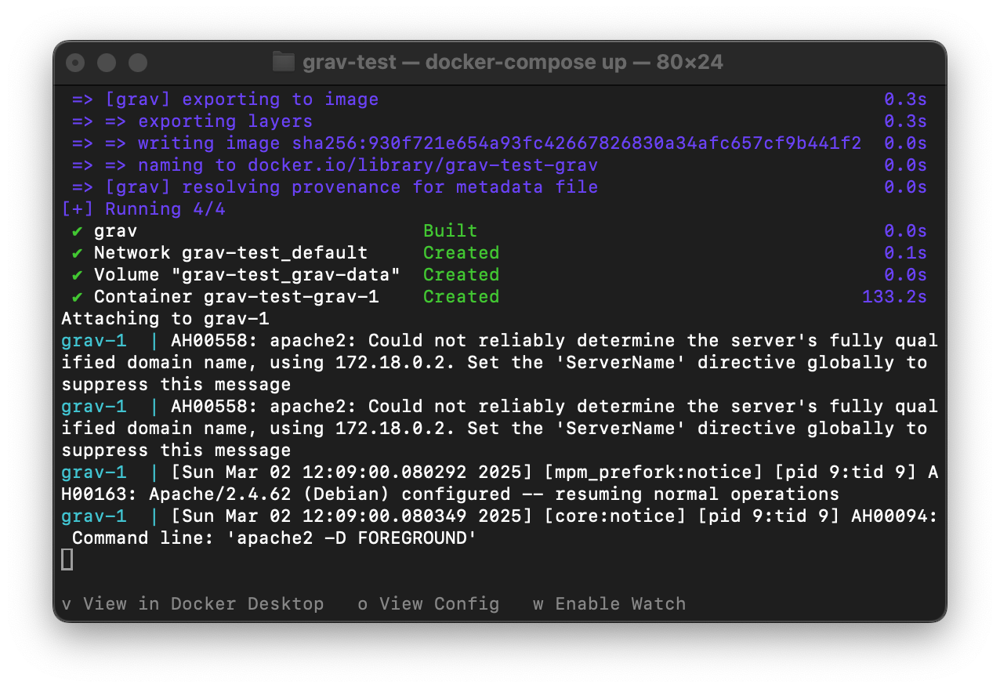
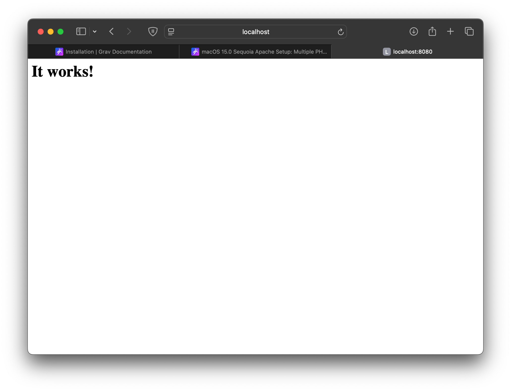
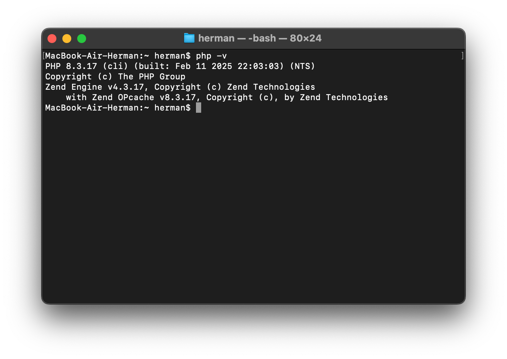
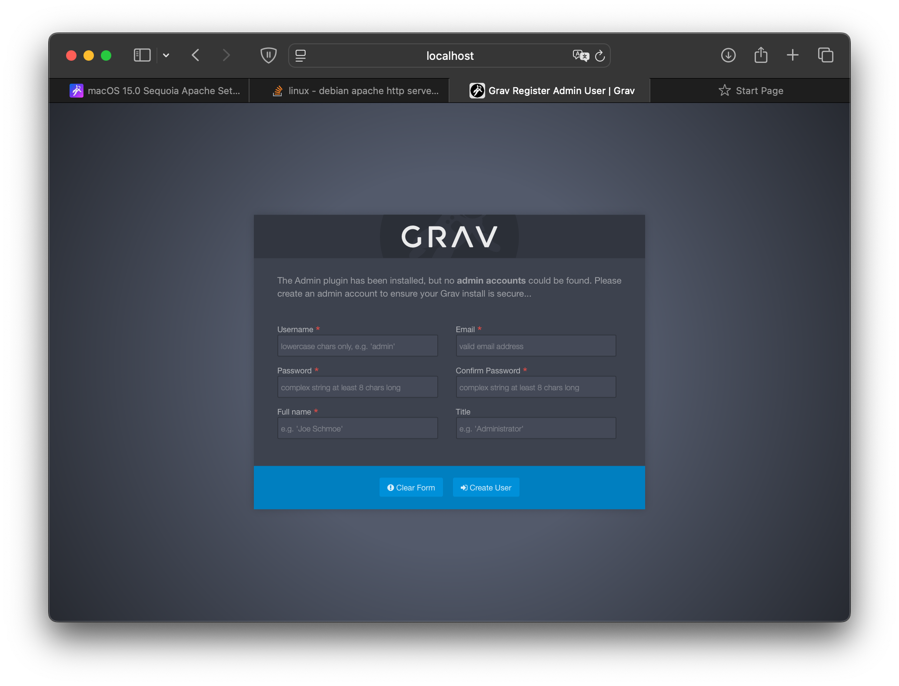
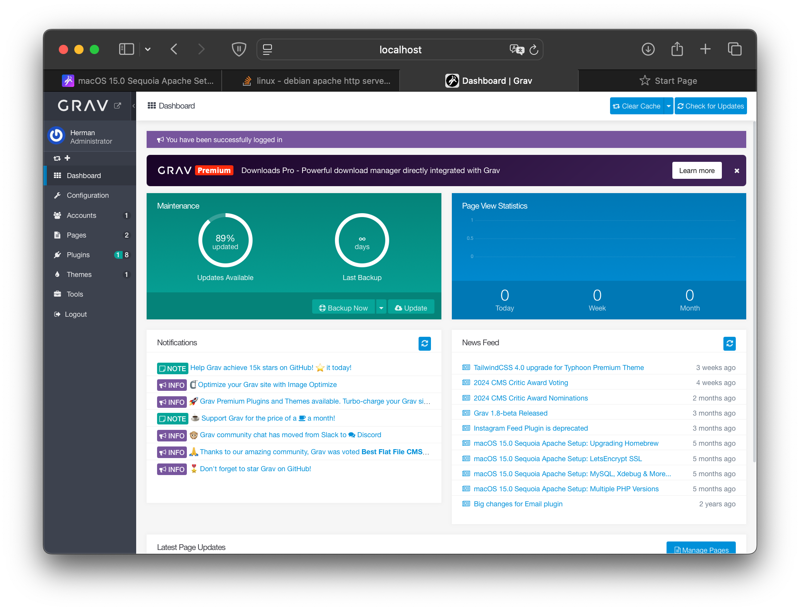
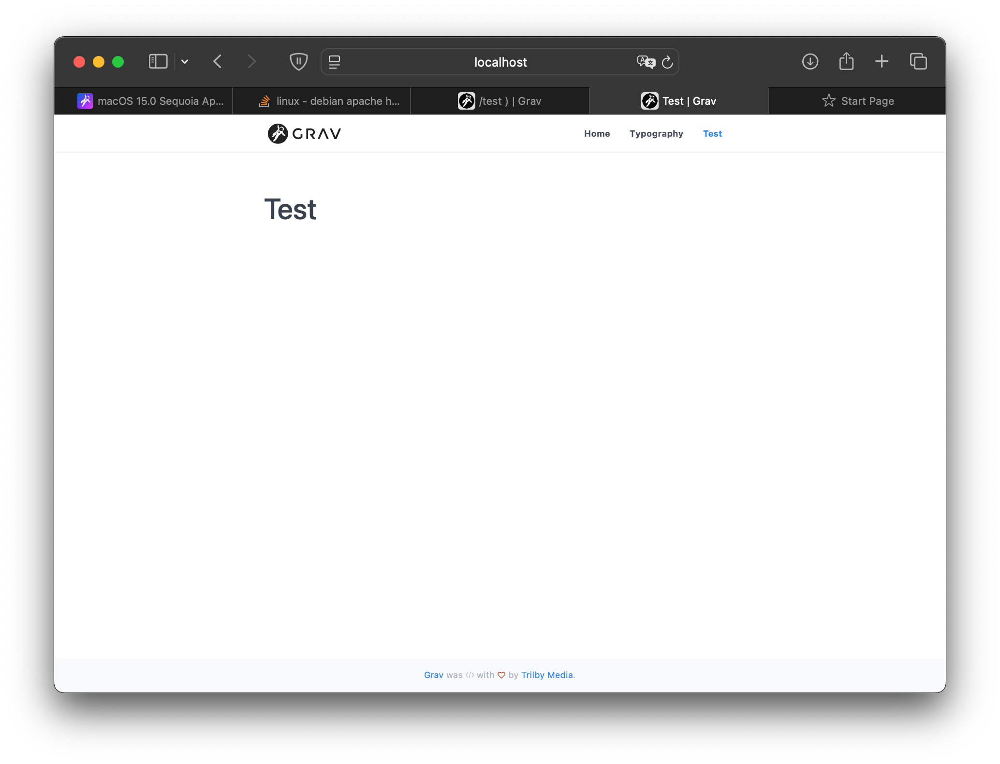
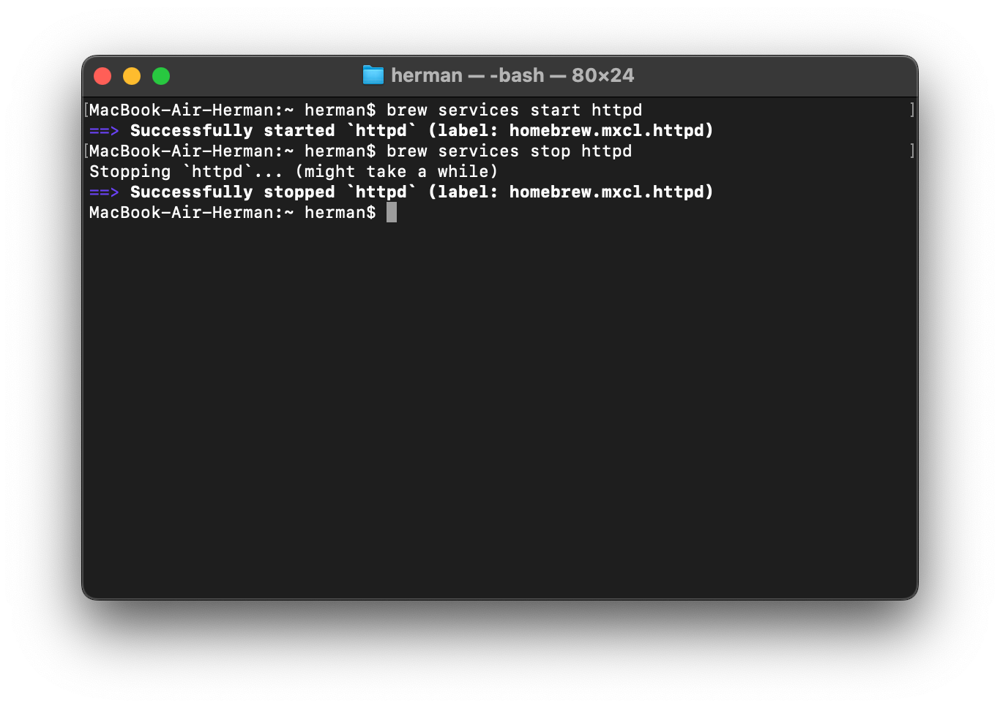

### Пальчук Герман Андреевич

# Задание 1.1. ИСР

### Задание:
Провести инсталляцию программного обеспечения. На основе материалов, опубликованных в примечаниях к заданию, инсталлировать необходимое ПО. 
В отчете поэтапно продемонстрировать процесс установки (в виде набора скриншотов) с ключевыми моментами установки.

### Выполнение
При запуске через контейнер, возникали ошибки. Поэтому работа была выполнена по инструкции https://getgrav.org/blog/macos-sequoia-apache-multiple-php-versions.

Сборка docker-compose:
 

1. Установлен пакет `httpd` для запуска Apache сервера. Произведена настройка файла `httpd.conf` согласно инструкции.

    Проверка работоспособности Apache:
 
2. Установлен PHP стабильной версии 8.3. Внесены изменения в файл `httpd.conf`.

    Версия PHP:
 
3. Скачан архив, содержащий Grav CMS. Для этого выполнены команды

    `cd ~/Sites`
    
    `curl -OJL https://getgrav.org/download/core/grav-admin/latest`.

   Архив распакован командой `unzip grav-admin*.zip`.
4. Проверяем работоспособность сайта. Сайт доступен по адресу http://localhost/grav-admin. Панель управления доступна по адресу http://localhost/grav-admin/admin. Ошибок нет, вход и регистрация доступны.

    Страница регистрации администраторов:

    
    Панель управления:

    
    Версия PHP:

5. Возможность публикации страниц
    
    Тестовая страница:
 

6. Запуск, остановка и перезапуск осуществляется командами

    `brew services start httpd`
    
    `brew services stop httpd`
    
    `brew services restart httpd`

    Выполнение команды:
